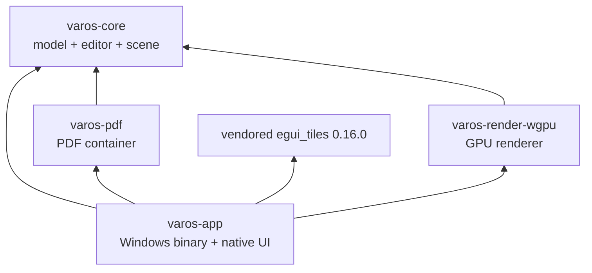

# Varos Dependency Map (F1, as-is)

**Baseline:** `1aff281` on 2026-07-11.
**Read-only evidence:** `cargo metadata --format-version 1 --no-deps`; `cargo tree -p <workspace-crate> -e normal`; each crate manifest; and direct source searches recorded below. No compilation occurred for F1.

## 1. Workspace dependency graph

`cargo metadata` reports exactly these four workspace members. `varos-app` is the only final application/binary crate; `varos-core` has no direct GPU, windowing, UI, or platform dependency.

### Allowed directions observed now

| From | May depend on | Evidence |
|---|---|---|
| `varos-core` | Pure Rust geometry/serialization/boolean crates only | `crates/varos-core/Cargo.toml:7-18`; no `wgpu`, `winit`, `egui`, or `windows` manifest entry. |
| `varos-render-wgpu` | `varos-core`, WGPU, egui rendering crates | `crates/varos-render-wgpu/Cargo.toml:7-13`; `src/lib.rs:1-8`. |
| `varos-pdf` | `varos-core`, PDF read/write crates | `crates/varos-pdf/Cargo.toml:7-11`; `src/lib.rs:18-22`. |
| `varos-app` | All three Varos lower crates plus native UI/platform crates | `crates/varos-app/Cargo.toml:10-29`; `src/main.rs:1-31`. |
| `varos-app::shell` | `egui_tiles` only through `shell/boxtree.rs` | `crates/varos-app/src/lib.rs:1-7`; `shell/boxtree.rs:1-22`. |

### Forbidden directions to preserve in later work

These are F1 observations and guardrails, not yet compiler-enforced architecture tests.

| Forbidden edge | Why |
|---|---|
| `varos-core -> varos-app`, `varos-render-wgpu`, `varos-pdf` | The document/editor must remain usable headlessly and independent of UI/container/renderer choices. |
| `varos-render-wgpu -> varos-app` or `winit` | Renderer accepts a raw surface target and scene; it must not own app/event-loop policy. |
| `varos-pdf -> varos-app` or renderer | Container persistence must not pull UI/GPU behavior into file compatibility. |
| `varos-app::shell` or `ui.rs` -> direct `Document` mutation without a reviewed command boundary | This is the intended F2+ separation; current `ui.rs` still applies private `Op` values directly to `Editor` at `ui.rs:5372-5454`. |
| Any module outside `shell/boxtree.rs` -> `egui_tiles` | The local-fork seam is explicitly localized by `varos-app/src/lib.rs:1-7` and `shell/boxtree.rs:1-22`. |

## 2. Direct external dependencies: proof of use

Every direct external dependency declared by the four workspace crates had at least one source use in F1. This does **not** mean every dependency is permanently justified; it means no direct manifest dependency is a proven unused dependency at this baseline.

### `varos-core`

| Dependency | Why it is present | Direct-use evidence | Cargo-tree note |
|---|---|---|---|
| `flo_curves` | Primary curve-preserving pathfinder operations. | `src/boolean.rs:2,8-9,33-204`. | Pulls `ouroboros` and the unmaintained `proc-macro-error` chain. |
| `i_overlay` | Polygon boolean fallback when curve operations produce no result. | `src/boolean.rs:3,10-12,169-205`. | Pure Rust geometry dependency. |
| `serde` | Serializable model/file/units schema. | `src/model.rs:6`, `src/file.rs:8`, `src/units.rs:17`. | Derive proc-macro only. |
| `serde_json` | Versioned raw-model blob serialization and unit test round trips. | `src/file.rs:23,32,36`; `src/units.rs:217`. | Shared by app shell serialization. |

### `varos-render-wgpu`

| Dependency | Why it is present | Direct-use evidence | Cargo-tree note |
|---|---|---|---|
| `wgpu` | Device, surface, pipelines, textures, and draw submission. | `src/lib.rs:14-70,207-281`. | Largest rendering/backend subtree. |
| `bytemuck` | POD vertex transfer types. | `src/tess.rs:7`. | Derive macro only beyond runtime trait use. |
| `egui` | UI primitive types passed to renderer. | `src/lib.rs:932-933,985-986`. | Shared version 0.35 throughout UI stack. |
| `egui-wgpu` | Renders egui onto Varos' WGPU frame. | `src/lib.rs:69,511-514,934,987`. | Depends on the same WGPU family. |

### `varos-pdf`

| Dependency | Why it is present | Direct-use evidence | Cargo-tree note |
|---|---|---|---|
| `pdf-writer` | Writes PDF pages and embedded model data. | `src/lib.rs:18-22,72+`. | Output-side PDF implementation. |
| `lopdf` | Opens PDFs and extracts the embedded model. | `src/lib.rs:344,347,359`. | Pulls `rayon -> crossbeam-epoch`; source of one RustSec advisory. |

### `varos-app`

| Dependency | Why it is present | Direct-use evidence | Cargo-tree note |
|---|---|---|---|
| `winit` | Window, platform event loop, DPI/window APIs. | `src/main.rs:17-18,515-655`; `src/ui.rs:12-13`. | Direct Windows desktop shell. |
| `pollster` | Blocks only for async GPU initialization. | `src/main.rs:557`. | Small synchronous executor. |
| `image` | Decodes embedded window/splash icon and creates raster debug dumps. | `src/main.rs:269-272,331`; `src/ui.rs:825,5526`. | PNG feature explicitly enabled. |
| `resvg` | Rasterizes SVG cursor artwork to Win32 cursor bitmaps. | `src/cursors.rs:3,7,216,251,281`. | Pulls `ttf-parser`, an unmaintained advisory noted by audit. |
| `raw-window-handle` | Extracts native HWND for platform integration. | `src/main.rs:548`. | Also transitive through WGPU/Winit. |
| `windows` | Win32 cursors, titlebar, GDI eyedropper, single-instance IPC. | `src/cursors.rs:303-610`; `src/single_instance.rs:50-190`. | Windows-specific platform service boundary. |
| `egui` | Native immediate-mode application UI. | `src/ui.rs` throughout; `shell/*.rs` throughout. | Core UI dependency. |
| `egui-wgpu` | Shares `ScreenDescriptor` types with renderer. | `src/ui.rs:968,1234`. | Same 0.35 version as renderer. |
| `egui-winit` | Routes Winit input into Egui state. | `src/ui.rs:668,843`. | Couples UI input to Winit only in app crate. |
| `rfd` | Native open/save and error/confirmation dialogs. | `src/main.rs:381-397,428-429,471-472,869,887-899`. | Windows dialog service. |
| `egui_tiles` | Docking shell tree, intentionally wrapped. | `src/shell/boxtree.rs:1-22`; root patch at `varos/Cargo.toml:10-15`. | Local vendored 0.16.0, not registry source. |
| `serde` | Serializable panel identifiers and shell layout. | `src/shell/registry.rs:9`; `shell/boxtree.rs:130`. | Shared model serialization family. |
| `serde_json` | Persists/round-trips shell tree JSON. | `src/shell/boxtree.rs:130-131,967`. | Direct shell use. |

## 3. Transitive dependency observations

`cargo tree -p <crate> -e normal` completed without a build and establishes the active lockfile paths. F1 records these as architectural inputs only; it does not upgrade, remove, or feature-prune dependencies.

- `varos-core -> flo_curves -> ouroboros -> proc-macro-error` explains the unmaintained macro warning.
- `varos-pdf -> lopdf -> rayon -> crossbeam-epoch 0.9.18` explains `RUSTSEC-2026-0204`.
- `varos-app -> resvg -> usvg/fontdb -> ttf-parser 0.25.1` explains the unmaintained `ttf-parser` warning.
- The WGPU/Egui/Winit stack carries Windows and graphics backend support transitively; any binary-size work must measure feature flags and supported backends rather than remove direct declarations blindly.

## 4. Local `egui_tiles` fork ledger

**Upstream basis:** crates.io `egui_tiles 0.16.0`, upstream VCS SHA `62ac74717ebe284749a0066adf9566bbbab9ee42` from the package `.cargo_vcs_info.json`.
**Comparison command:** `git diff --no-index -- <cargo-registry>/egui_tiles-0.16.0 varos/vendor/egui_tiles`.
**Result:** five modified source files. The three registry packaging-only files (`.cargo-ok`, `.cargo_vcs_info.json`, `Cargo.toml.orig`) are absent from the repository and are not Varos behavior changes.

| Vendored file | Upstream difference | Varos reason/effect | Evidence |
|---|---|---|---|
| `src/behavior.rs` | `paint_drag_preview` takes a `DropPreview`; adds `pane_is_drop_target` and `pane_is_tab_drop_target` hooks. | Lets the canvas refuse tab/drop targets and lets Varos draw direction-aware previews. | Diff hunks around upstream 386/450; local `behavior.rs:386-456`; consumer `shell/boxtree.rs:699+`. |
| `src/container/linear.rs` | Removes `linear_drop_zones` use and deletes its helper. | Disables whole-container seam drop zones; Varos docks against an individual box edge. | Diff hunks around upstream 245, 319, 482; local comments document the model. |
| `src/container/tabs.rs` | Returns before native tab-bar layout when configured height is below one pixel. | Prevents Epaint `Bad px_scale_factor: 0` when Varos renders its own chip tabs. | Diff hunk around upstream 225; local `tabs.rs:225-231`. |
| `src/lib.rs` | Adds public `DropSide`/`DropPreview`; rewrites `DropContext` targeting and stores explicit dock direction. | Implements Varos' 20% edge docking / 60% center-tab model and board opt-outs. | Diff hunks around upstream 223,319,326,374,432; root patch `Cargo.toml:12-15`. |
| `src/tree.rs` | Replaces rectangular preview use with direction/neighbour preview; adds neighbour lookup and short post-drop glide state. | Draws two-box seam feedback and movement after docking. | Diff hunks around upstream 319,461,491,516,833; consumer `shell/boxtree.rs:98-100,699+`. |

### Fork constraints discovered in F1

- The root comment in `varos/Cargo.toml:10-13` says the “only edit” is a narrow hook. That statement is stale: the behavioral delta spans five files and includes a deleted function plus animation/docking policy.
- The local fork is deliberately isolated to `varos-app/src/shell/boxtree.rs`; preserve that isolation during F2+.
- F1 does **not** rebase, prune, or change the fork. A later `VENDOR_PATCHES.md` should promote this ledger into an ongoing upstream/rebase contract.

## 5. F1 decisions deferred

- Whether to remove or replace any direct dependency.
- Whether to limit WGPU backends/features for distribution size.
- Whether to remove runtime SVG rasterization and thereby change the cursor asset pipeline.
- Whether to rebase or replace `egui_tiles`.

All require a reviewed architecture/command-boundary decision and measured before/after data; none is authorized by inventory alone.

## 6. CI activation note (F1 prepared change)

At the baseline, `.github/workflows/ci.yml:7-15` was intentionally `workflow_dispatch` only because the GitHub account billing-verification hold prevented hosted-runner use. F1 prepares a separate one-line trigger change to `on: [push, pull_request, workflow_dispatch]`.

That change **does** make GitHub attempt fmt, clippy, tests, and workspace build automatically on pushes and pull requests once runners are available. It **does not**:

- clear the GitHub billing/verification hold or guarantee a runner starts;
- configure required checks or branch protection, which are repository settings reserved for Ahmed;
- make `cargo audit` blocking, because the workflow deliberately retains `continue-on-error: true` while the three advisories and three unmaintained warnings are triaged;
- pin the Rust toolchain, because the workflow still names `dtolnay/rust-toolchain@stable`.

The separate CI commit therefore creates an early regression belt for architectural extraction without falsely claiming that GitHub settings or dependency hygiene are complete.
