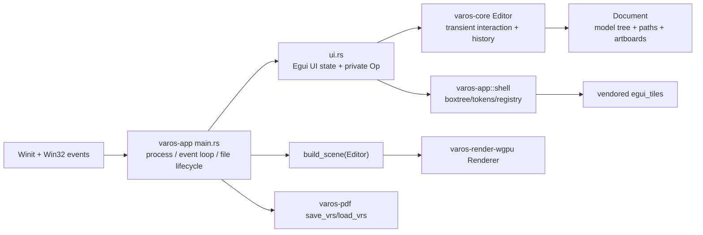

> **Status:** current — Active project document, governed by the authority ladder in `docs/foundation/FOUNDATION_CHARTER.md` §3.
# Varos Ownership Map (F1, as-is)

**Baseline:** `1aff281` on 2026-07-11.
**Purpose:** record who owns what **today** before any extraction. This is not a target architecture, a rename plan, or approval to move code.
**Evidence:** module declarations/re-exports, caller searches, and the responsibility ranges below. Line references use the baseline file content.

## 1. Current runtime flow

`main.rs` creates `Ui`, `Editor`, and `Renderer` (`main.rs:557-567`), calls `Ui::run`, then builds a renderer-neutral scene and sends it to the renderer (`main.rs:646-647,1031-1032`). It calls PDF-container open/save directly (`main.rs:418,881`). This establishes the current integration owner: the binary crate, not a separate application/service layer.

## 2. Crate ownership and public surfaces

| Crate / module | Owns now | Public surface / principal callers | Boundary observation |
|---|---|---|---|
| `varos-core` | Serializable model, geometry, interaction/editor state, tools, boolean operations, scene construction, units, raw model blob/file helper. | `lib.rs:4-15` exports modules plus `Editor`, `ToolKind`, `Scene`, `View`, `BoolOp`, units. Called by app, PDF crate, renderer crate, and integration tests. | The hard no-platform/no-GPU seam is real; its API is broad. |
| `varos-core::model` | `Document`, scene-tree nodes, paths/anchors, artboards, masks, persistent settings, structural tree operations. | `Document` and many fields are public (`model.rs:499-549`); called directly by `Editor`, `scene`, `file`, PDF crate, app UI, and tests. | Structural invariants and raw representation live together; external direct field access exists. |
| `varos-core::editor` | Transient selection, tool state, pointer gesture state, snapping, history, editing behavior and panel operations. | `Editor` exposes public document and many transient fields (`editor.rs:322-371`) plus a large public method surface. Called by app UI/main and `scene`. | It is the current behavior facade, but also the largest cross-domain concentration. |
| `varos-core::tools` | Tool-specific pointer behavior for object/direct/pen/shape/rotate/convert/eyedropper. | Module list in `tools/mod.rs`; dispatched by `Editor` input methods (`editor.rs:3141-3754`). | Useful domain split exists below a large central dispatcher. |
| `varos-core::scene` | Converts editor/document state into renderer-neutral `Scene`, `Prim`, `Group`. | `build_scene` and scene types are re-exported at `lib.rs:12-13`; called from app `main.rs:14,646,1031`; consumed by renderer. | Strong renderer seam; renderer does not own document semantics. |
| `varos-core::file` | Versioned raw JSON blob and atomic file helper. | `doc_to_blob`, `doc_from_blob`, `write_atomic`, legacy raw `.vrs` APIs at `file.rs:22-59`; called by PDF container and tests. | Persistence primitives exist in core while the active container lives in `varos-pdf`. |
| `varos-core::boolean` / `geom` / `units` | Boolean math, geometric/view primitives, document units. | Re-exported types/functions; used internally throughout core and by app/renderer. | Utility ownership is already comparatively coherent. |
| `varos-render-wgpu` | WGPU device/surface lifecycle, tessellation, stencil/compositing pipelines, and egui paint upload/draw. | `Renderer::{new,resize,render,render_splash,render_ui}` at `src/lib.rs:27,207,562,875,930,981`; called only from app main. | Clean one-way dependency on scene/view; no Winit dependency in its manifest. |
| `varos-pdf` | Valid-PDF serialization, embedded editable model, PDF extraction, legacy raw JSON detection. | `save_vrs`, `load_vrs`, `write_pdf` at `src/lib.rs:30-72`; called by app main and PDF tests. | Clean one-way dependency on core, but it currently owns parser exposure and PDF durability concerns. |
| `varos-app::main` | Process startup, window/event loop, native dialogs, input shortcuts, view state, save/open, crash dialog, rendering schedule. | Binary entry point; imports all lower Varos crates. | Integration is highly concentrated here, but its role is appropriately application-specific. |
| `varos-app::ui` | Egui context/state, UI composition, snapshots, icons, panels, shell hosting, private UI operations, direct Editor application. | `Ui::{new,on_event,wants_*,run}` at `ui.rs:755-1243`; constructed/called only by `main.rs`. | UI emits `Op` then directly mutates `Editor` in the same file; this is the current coupling point between UI and Editor. |
| `varos-app::shell` | Docking box tree wrapper, panel IDs/placeholder registry, visual tokens. | `varos-app/src/lib.rs:1-7` re-exports `ShellState`/`PanelId`; used by `ui.rs:18,710,885,1056`. | `egui_tiles` is contained here, though real panel bodies are hosted by `ui.rs`. |
| `varos-app::cursors` | SVG cursor rasterization, Win32 cursor/titlebar/DPI/GDI support, system eyedropper. | Called by `main.rs` and `ui.rs`; Win32 functions concentrated in this module. | Platform code is mostly isolated, but broad in responsibility. |
| `varos-app::single_instance` | Windows mutex, window activation, `WM_COPYDATA` file forwarding. | Called by `main.rs`; uses Win32 APIs only. | A small explicit platform service boundary. |

## 3. Current module-to-module call relationships

| Caller | Calls / reads | Evidence |
|---|---|---|
| `app/main.rs` | `Editor`, `build_scene`, `Renderer`, `Ui`, PDF load/save, cursors, single-instance service. | `main.rs:14-31,418,557-567,646-647,881,1031-1032`. |
| `app/ui.rs` | `Editor` methods and public fields; `View`; `shell::ShellState`/tokens; `cursors`; Egui/Winit. | Imports `ui.rs:9-18`; direct mutation dispatch `ui.rs:5372-5468`. |
| `core/editor.rs` | `model`, `geom`, `boolean`, `tools`, `units` and its own history. | `editor.rs` method regions in section 5 below. |
| `core/scene.rs` | `Editor` and model geometry to produce `Scene`. | `scene.rs:87`; app calls `build_scene` rather than renderer reading document. |
| `render-wgpu` | `core::scene::{Scene, Prim}` and `core::geom::View`; no application code. | `render-wgpu/src/lib.rs:6-8`. |
| `pdf` | `core::file` blob functions and `core::model` types; no UI/renderer code. | `pdf/src/lib.rs:18-22`. |
| `shell/boxtree.rs` | `egui_tiles` and a host callback supplied from `ui.rs`. | `boxtree.rs:1-22,51-55`; `ui.rs:1056-1131`. |

## 4. Leaf-module register

This register makes the previous crate summary exhaustive for first-party workspace source. “Caller” names the immediate owner or known integration caller, not every test call site.

| Crate | Module/file | Owns now | Surface / caller |
|---|---|---|---|
| core | `lib.rs` | Module declarations and curated re-exports. | All other Varos crates enter through `varos_core`. |
| core | `boolean.rs` | Curve-preserving boolean path operations with polygon fallback. | `Editor::pathfinder` (`editor.rs:970-1074`). |
| core | `editor.rs` | Behavior facade, transient interaction, history, and cross-domain edit orchestration. | App UI/main, scene builder, integration tests. |
| core | `file.rs` | Versioned raw-model blob and atomic file helper. | PDF container and core file tests. |
| core | `geom.rs` | `Pt`, `Rgba`, `View`, geometric primitives and zoom helpers. | All core domains; app and renderer consume `View`/types. |
| core | `model.rs` | Persistent `Document`, nodes, paths, artboards, structural mutations. | Editor, scene, file, PDF, UI direct reads/writes, tests. |
| core | `scene.rs` | `Scene`/`Prim`/`Group` construction. | App calls `build_scene`; renderer consumes output. |
| core | `tools/mod.rs` | Stateless-tool trait and `ToolKind` dispatch. | `Editor::pointer_down`. |
| core | `tools/object.rs` | Object selection press behavior. | `tools::get(ToolKind::Object)`. |
| core | `tools/direct.rs` | Direct selection press behavior. | `tools::get(ToolKind::Direct)`. |
| core | `tools/pen.rs` | Pen press behavior. | `tools::get(ToolKind::Pen)`. |
| core | `tools/shapes.rs` | Shape placement press behavior. | `tools::get` for Rect/Ellipse/Triangle/Polygon. |
| core | `tools/rotate.rs` | Rotate and scale press behavior. | `tools::get` for Rotate/Scale. |
| core | `tools/convert.rs` | Anchor/handle conversion press behavior. | `tools::get(ToolKind::Convert)`. |
| core | `tools/eyedropper.rs` | Canvas eyedropper press behavior. | `tools::get(ToolKind::Eyedropper)`. |
| core | `units.rs` | Document unit conversion and formatting. | Document settings, UI properties, tests. |
| renderer | `lib.rs` | Public WGPU renderer, surface lifecycle, pipelines, composition and Egui draw bridge. | App main only. |
| renderer | `tess.rs` | CPU tessellation, draw batches, scissor calculation. | Private `lib.rs` module (`lib.rs:4-6`). |
| pdf | `lib.rs` | PDF write, model embed/extract, `.vrs` load/save API. | App main and PDF integration tests. |
| app | `main.rs` | Binary composition root, Winit loop, platform/session/file command lifecycle. | OS process entry. |
| app | `ui.rs` | Full native Egui workbench and UI-to-editor operation bridge. | Private module of main (`main.rs:28`). |
| app | `cursors.rs` | Win32 cursor, custom titlebar, screen-pixel sampling implementation. | Main and UI. |
| app | `single_instance.rs` | Mutex/IPC/open-forwarding platform service. | Main. |
| app library | `lib.rs` | Re-exports only the shell package for reuse. | Main's private UI module imports `varos_app::shell`. |
| app shell | `shell/mod.rs` | Shell module boundary and public `ShellState`/`PanelId`. | UI. |
| app shell | `shell/boxtree.rs` | Egui tile wrapper, docking behavior, panel host abstraction, drag presentation. | UI's hosted shell. |
| app shell | `shell/registry.rs` | `PanelId` enum and sample panel rendering. | `boxtree.rs` / UI shell integration. |
| app shell | `shell/tokens.rs` | Visual tokens and Egui style setup. | UI and shell painting. |

The integration-test files and compatibility fixtures are inventory items, not runtime modules; their ownership is recorded in `INVENTORY.md` as the core/PDF test corpus.

## 5. `ui.rs` responsibility map (5,563 lines)

The ranges below are contiguous implementation regions, not proposed future modules. A function may rely on state defined earlier; the purpose is to make future extraction scope explicit before anyone touches code.

| Lines | Current responsibility | Evidence / main symbols |
|---:|---|---|
| 1-90 | Imports, UI design notes, and a large embedded Lucide SVG icon catalogue. | Module header and icon constants. |
| 91-193 | Private operation protocol and UI-local enums. | `Op`, `WinAction`, picker/color enums. |
| 194-505 | Color harmony/modal data, layer-row data model, tree-to-layer-row helpers, thumbnails. | `Harmony`, `ColorModal`, `LRow`, `build_layer_rows`, `thumb_shapes`. |
| 506-658 | Per-frame editor snapshot types for selected objects and artboards. | `Snap`, `AbSnap`, `AbInfo`, `ab_infos`. |
| 659-753 | `Ui` state and icon texture loading. | `Ui`, `LayerIcons`, `load_icon*`. |
| 754-1243 | `Ui` lifecycle, Egui event routing, pointer/key gates, splash, frame composition, shell hosting, and deferred-op collection. | `Ui::{new,on_event,wants_*,run}`. |
| 1244-1383 | Icon SVG wrappers, fonts/style setup, persistent menu state, basic panel frame. | `lucide*`, `install_*`, `menu_*`, `panel_frame`. |
| 1384-2623 | Generic numeric fields and the entire color-picker/modal implementation. | `num_field`, HSV helpers, `build_color_modal`. |
| 2624-3239 | Splash, custom window controls, document tabs, menus, and top bar. | `build_splash`, `winctl`, `build_topbar`. |
| 3240-3810 | Canvas-adjacent chrome: void, status bar, tool rail, control bar, fill/stroke and tool selectors. | `build_statusbar`, `board_rail`, `board_ctlbar`, `fill_stroke_control`, `shape_slot`. |
| 3811-4353 | Dock icon bundle and Layers panel (row paint, selection, drag/drop, rename, footer). | `DockIcons`, `panel_layers`, `elide`. |
| 4354-4719 | Properties, document settings, alignment, and pathfinder panels. | `panel_properties`, `document_section`, `panel_align`, `panel_pathfinder`. |
| 4720-5318 | Artboard panel and on-canvas artboard chrome/rulers. | `AbIcons`, `panel_artboard`, `build_ab_chrome`, `board_rulers`. |
| 5319-5371 | Origin crosshair and snapping HUD. | `build_origin_crosshair`, `build_snap_hud`. |
| 5372-5469 | UI-private `Op` to direct `Editor` mutation dispatch, including local stroke-width mutation. | `apply_ops`, `set_stroke_width`. |
| 5470-5563 | Developer icon PNG dump plus local color unit tests. | `dump_tool_icons`, `color_tests`. |

### What `ui.rs` owns indirectly

- It imports `varos_app::shell` but supplies most real panel bodies through the shell host callback (`ui.rs:1056-1131`).
- It reads and writes `Editor` public fields directly as well as calling methods; `apply_ops` writes `ed.doc` at `ui.rs:5436-5448` and `set_stroke_width` mutates paths at `ui.rs:5453-5468`.
- Its `Op` enum is private (`ui.rs:91`), so menus, shortcuts, automation, and future plugins do not currently share an application command contract.

## 6. `editor.rs` responsibility map (4,533 lines)

| Lines | Current responsibility | Evidence / main symbols |
|---:|---|---|
| 1-321 | Interaction enums and low-level helpers: modifiers, tool/drag states, selection transform state, snapping and alignment helper types. | `Mods`, `ToolKind`, `Drag`, `TfHit`, `AbDrag`, `SnapGuide`, `AlignTarget`; helper functions. |
| 322-422 | `Editor` storage and initialization. | `Editor` exposes `doc`, selections, transient gesture state, view prefs, paint state, history fields. |
| 423-757 | Selection-aware queries, hit tests, selection transform frame, and translation primitive. | `path_under`, `transform_hit`, `start_transform`, `translate_path`. |
| 758-969 | A7 live-transform seam: unit xforms, baking, rotation composition, world/local geometry. | `bake_unit*`, `rotate_unit*`, `finish_rotate_drag`. |
| 970-1538 | Pathfinder, arrange, align/distribute, flip, numeric object transform setters. | `pathfinder`, `arrange`, `align`, `distribute*`, `set_obj_bbox`, `set_obj_rotation`. |
| 1539-1667 | Group/ungroup and transform-again. | `group_selection`, `ungroup_selection`, `transform_again`. |
| 1668-2120 | Artboard selection, drag/move/resize/create, and panel/on-canvas artboard edits. | `ab_*` methods. |
| 2121-2868 | Snapping engine, grid fallback, smart guides, equal-gap detection, origin/pivot snap, and guides. | `snap_*`, `guide_*`. |
| 2869-2949 | Snapshot history, undo/redo, transient reset, document replacement. | `begin`, `commit`, `undo`, `redo`, `replace_doc`. |
| 2950-3140 | Shared mutable path/anchor operations and shape-anchor creation. | `reverse`, `delete_anchor`, `add_anchor`, `shape_anchors`. |
| 3141-3754 | Tool selection/hints and central pointer down/move/up dispatch. | `eff_tool`, `pointer_down`, `pointer_move`, `pointer_up`. |
| 3755-3900 | Keyboard/tool commands, escape, nudge, delete, double-click. | `set_tool`, `escape`, `nudge`, `delete_selected`. |
| 3901-4144 | Fill/stroke, color picker live session, selection paint settings, path visibility/lock/name. | `apply_paint`, `picker_*`, `set_hidden`, `rename_path`. |
| 4145-4479 | Layers-panel structural and selection operations plus artboard visibility/lock and eyedropper. | `layer_*`, `ab_toggle_*`, `eyedrop`. |
| 4480-4533 | Local picker-session tests. | `#[cfg(test)]` module. |

### Current coupling facts

- `Editor` combines persisted document state with transient input state and history in one public struct (`editor.rs:322-371`).
- `Document` combines path storage, legacy compatibility fields, scene tree, artboards, units, snapping, and guides (`model.rs:499-549`).
- `ui.rs` directly accesses these public fields. That is a documented **as-is** condition, not a judgment that public fields are wrong or authorization to privatize them in F1.
- The tools folder reduces tool-specific code inside `editor.rs`, but `Editor` remains the dispatcher and owner of cross-cutting gesture/history policy.
